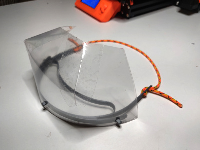
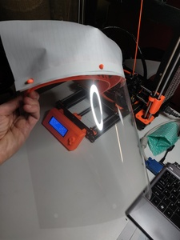
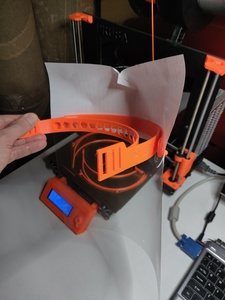
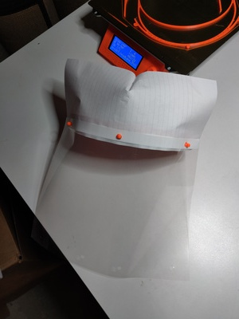
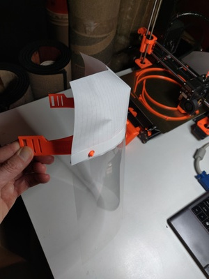

## Instructions for a cheap brow shield

> New!  Updated brow shield design.  Updated instructions and template coming soon.
> 

The open top design of the headband allows for flexibility, reduced print time, and reduced material usage.  But it opens up pathway for airborne particles.

To reduce this pathway, here's an idea for a really cheap brow shield.  Requirements:

- 3-hole punch sheet (plastic or paper)
- Scissors or paper cutter
- Stapler or tape

Instructions:

1. Hole punch sheet if not already punched
2. Cut lengthwise to desired height
2. Snap onto headband pins
3. Small fold down center to create crown
4. Staple or tape in place
5. Add transparent face shield!

Photos:

