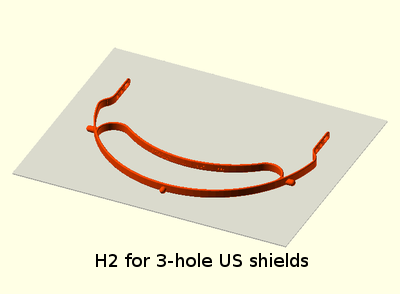

# H2 headband for face shield PPE

## Print recommendations
- Material: PETG
- Layer height: 0.3mm
- Infill: 70%
- Support: None
- Brim: Off

- [Gcode](gcode/PrusaMK3/so_h2_us_qty2_0.3mm_PETG_MK3_1h2m.gcode) using recommendations for Qty 2 H2 US 3-pin on a Prusa i3 MK3

## Legend
- US (3-pin for standard US 3-hole punch shields)
- Prusa (4-pin for Prusa shields)
- VerkUS (6-pin for 3DVerdstan V3 US shields)

