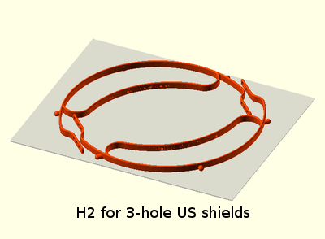

#H2 headband for face shield PPE

##Print recommendations
- Material: PETG
- Layer height: 0.2mm
- Infill: 70%
- Support: None
- Brim: Off

##Legend
- US (3-pin for standard US 3-hole punch shields)
- Prusa (4-pin for Prusa shields)
- VerkUS (6-pin for 3DVerdstan V3 US shields)

