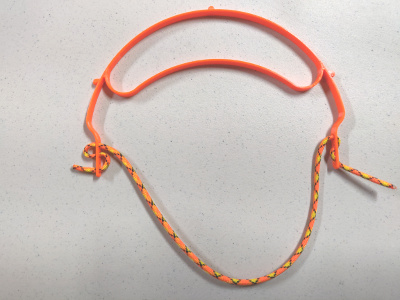
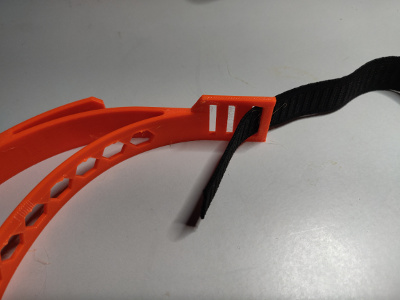
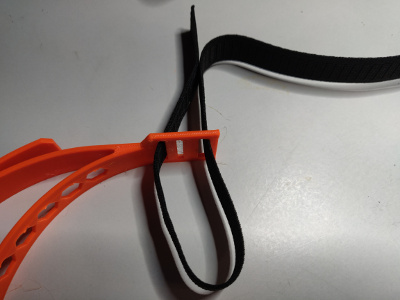
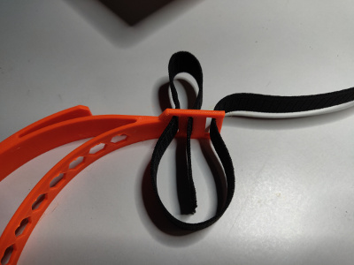
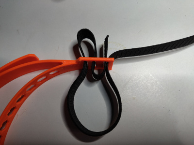

# How to thread cord for H2 and slim (paracord 550 recommended, easiest method)

Tip: The cord should be approximately 18" (46cm).

Step 1: Thread cord through narrow forwardmost hole from inside of headband

Step 2: Thread cord through narrow center hole from outside of headband

Step 3: Thread cord through wide hole from inside of headband

Step 4: Pull tight and adjust to length desired

Repeat on other side!

For adjustment: slip cord in and out in desired direction for tighter of looser.  Adjust for comfortable pressure from the flexible brow band.  To adjust up or down on brow while wearing, lightly push in both on sides of the headband and it will temporarily loosen to ease up/down position.

---

---

# How to thread elastic band (most non-slip method)

Tip: The elastic band should be approximately 18" (46cm).

Step 1: Thread elastic through wide hole from outside of headband

Step 2: Thread elastic through narrow forwardmost hole from inside of headband

Step 3: Thread elastic through narrow center hole from outside of headband

Step 4: Thread elastic through wide hole from inside of headband

Step 5: Pull tight and adjust to length desired

Repeat on other side!
