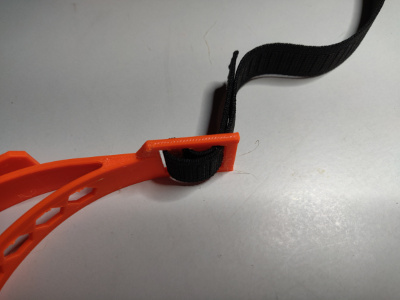

# How to thread cord (paracord 550 recommended) (easiest method)

Tip: The cord should be approximately 18" (46cm).

Step 1: Thread elastic through wide hole from outside of headband

Step 2: Thread elastic through narrow forwardmost hole from inside of headband

Step 3: Thread elastic through narrow center hole from outside of headband

Step 4: Thread elastic through wide hole from inside of headband

Step 5: Pull tight and adjust to length desired

Repeat on other side!

---

---

# How to thread elastic band (most non-slip method)

Tip: The elastic band should be approximately 18" (46cm).

Step 1: Thread elastic through wide hole from outside of headband

Step 2: Thread elastic through narrow forwardmost hole from inside of headband

Step 3: Thread elastic through narrow center hole from outside of headband

Step 4: Thread elastic through wide hole from inside of headband

Step 5: Pull tight and adjust to length desired

Repeat on other side!
