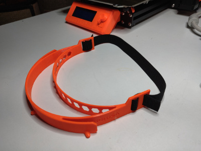

# Protective Visor Headband

## Modification of Prusa covid19 visor headband to use elastic strap without button holes

contains
- [original](covid19_headband_rc2.stl) Prusa RC2 STL model (downloaded Mar 22, 2020)
- [modified](covid19_headband_rc2_bpm02.stl) Prusa RC2 STL model replacing strap attachment with cinch design to allow use of flat web strap without holes (using strap width of 3/4" or 20mm)
- OpenSCAD [code](covid19_headband_rc2_bpm03.scad) used to generate modified STL model (easy change to different designed strap width)
- PDF of [cut template](PrusaFaceShieldHoles.pdf) for positioning holes in shield (using primarily overhead transparency sheets 8 1/2" by 11")

Tip:  Zoom in on [large photo](IMG_20200323_084829.jpg) to see how strap is laced.

Tip:  Paper clip your printed [cut template](PrusaFaceShieldHoles.pdf) to your transparency before punching holes to maintain proper hole alignment.

Thanks Josef Prusa for your open support.  Original model was obtained [here](https://www.prusaprinters.org/prints/25857-prusa-protective-face-shield-rc1).
