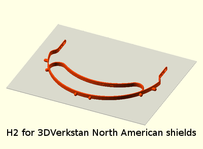

# Protective Face Shield for COVID-19

## Design for Reusable Headband with Low Cost Replacement Shields

> *Brand new design released 4/7/2020*
>  - *Added design for 3DVerkstan North American shields 4/8/2020*
>  - *Added design for Prusa shields 4/10/2020*
>
> ### Introducing *H2*!
>
> 
>
> This ground-up new design takes full advantage of the innovations in our slim cord design and features:
> - 30% reduced print time and material compared to the last slim design.  That's a time and material reduction of *3.5X* compared to the Prusa RC2.
> - Smooth integrated shield and arm design.  Reduces breakage points and hard edges.  Much easier to clean without excessive tight spaces!
> - Flexible brow band design to provide comfort while using widely available fixed length cords.
> - Integrated cinch holes for cord length adjustment.
>
> - You can download STL models in the Makers section now!  Keep in tune to see our upcoming laser cut version H2L.

Fully assembled H2 headband with face shield and brow shield

---

The urgent need for personal protection equipment in this time of covid19 pandemic is the motivation for these documents.  This is an attempt to provide additional equipment by local community members to help with any shortages of approved equipment.  Please feel free to submit your own suggestions and feedback.

---
---

### For Users

Visors to shield the face are the first line of defense when confronted with infected persons.  They can be up to [92-96% effective](https://www.ncbi.nlm.nih.gov/pmc/articles/PMC5015006/#S3title) as reported by NIH.  It is the purpose of these designs to create a reusable headband that supports low cost, easily replacable shields.  You'll find my NIH design submission [here](https://3dprint.nih.gov/discover/3dpx-013642). Cheap plastic shields can consist of transparency sheets, lamination sheets, or other clear plastic sheets.  Or they can be [purchased](https://www.professionalplastics.com/PETGSHEET) in many different bulk forms; Professional Plastics has tabs for full sheets or cut-to-size.  I think I would recommend 0.020 sheet thickness in the full sheet tab to minimize cost.  I am not affiliated with Professional Plastics, nor have I even purchased from them, so take this info as a potential lead.

To make shields easy to obtain in the US market, a standard three-hole punch design is utilized.  Thus high volume production of shields requires only a ream of transparency sheets and a three-hole punch, both of which are widely available.  Alternate shield materials can also be used if dimensioned to the standard 11" width.

Additional shield designs that have gained traction recently are [3DVerkstan](https://3dverkstan.se/protective-visor/protective-visor-versions/) and [Prusa](https://www.prusaprinters.org/prints/25857-prusa-protective-face-shield-rc1).  Depending upon who you are working with, they may have a preferred shield design.  As such, I've provided designs that are compatible with these other shields.  See in the Maker section below.  If you have a shield design with different hole placements that you would like me to support, send a request to the contact listed below. If reasonable, I can publish a supporting design rather quickly.

#### Instructions

- [Threading](LoopThread/ThreadInstructions.md) of band for H2, slim cord and older cinch designs.  Tip:  The band or cord should be approximately 18" (46cm).
- Making shields for [three-hole design](3HoleShieldInstructions.md)
- Making top [brow shields](BrowShieldInstructions.md) for three-hole design
- Don't expose the plastics to high temperature.  The heat will deform the material.

---
---

### For Makers
Introducing our brand new released H2 design.  Created from scratch to fully take advantage of the innovations introduced in the slim cord design, H2 designs the shield band to smoothly flow into the arms with a cord cinch.  The continuous flow improves strength and reduces hard edges.  And most importantly, the new H2 design reduces print time and filament by 30% compared to the prior slim cord design.  That's a 3.5X improvement in print speed compared to the original Prusa RC2 headband!

If you have a shield design with different hole placements that you would like me to support, send a request to the contact listed below. If reasonable, I can publish a supporting design rather quickly. 

#### Most Recent H2 STL Models
I've been printing these models for donation to our local county health department on a Prusa i3 MK3.  I'm using PrusaSlicer 2.2.0 with PETG as material, 0.4mm nozzle, 0.3mm height, 70% infill, no supports, no brim.  The high infill is only a small time penalty and gives a bit more robustness to the joins.  Under these conditions, I'm seeing 1:02 print times for a Qty 2 piece print.

##### H2 STL models for 3-hole shields using US standard hole punch
 - Three-pin **H2** headband with cinch [(Qty 1)](H2/stl/so_h2_us.stl) [(Qty 2)](H2/stl/so_h2_us_qty2.stl) for paracord
 
 

##### H2 STL models for 3DVerkstan North American shields
 - Six-pin **H2** headband with cinch [(Qty 1)](H2/stl/so_h2_us_verkstan.stl) [(Qty 2)](H2/stl/so_h2_us_verkstan_qty2.stl) for paracord
 
 

##### H2 STL models for Prusa shields
 - Four-pin **H2** headband with cinch [(Qty 1)](H2/stl/so_h2_prusa.stl) [(Qty 2)](H2/stl/so_h2_prusa_qty2.stl) for paracord
 
 

### Archive of older designs

Help generate headbands for our urgent care providers. Choose a design that fits the band that you can obtain, or modify to your own design.  If you do create equipment, it is important to create a sterile environment and handling so that you don't accidentally transmit any virus.  Here you will find:

#### STL models
I've included a number of preconfigured STL models for different configurations (see **Design Tools** below for generating your own variations of STL).  Which model to choose will be determined by the elastic band materials you can obtain.  You can import any of these directly to your slicer (PETG is recommended material, 0.4mm nozzle, 0.2mm height, 20% infill):

##### STL design models for 3-hole shields using US standard hole punch
- Three-pin headband with **slim cord design** [(Qty 1)](older/stl/covid19_headband_3hole_cord_slim.stl) [(Qty 2)](older/stl/covid19_headband_3hole_cord_slim_qty2.stl) for parachute cord strap. Soft spring browband design provides elasticity.  *Slim design reduces print time and material by half!*

- Three-pin headband with **cinch design** [(Qty 1)](older/stl/covid19_headband_3hole_cinch.stl) [(Qty 2)](older/stl/covid19_headband_3hole_cinch_qty2.stl) for flat 3/4" (38mm) elastic bands (non-elastic bands can also marginally work)

- Three-pin headband with **button design** [(Qty 1)](older/stl/covid19_headband_3hole_button.stl) [(Qty 2)](older/stl/covid19_headband_3hole_button_qty2.stl) for button hole elastic band  (Update: Prusa has newly released their official version of this type of design.)

##### STL design models for 4-hole shields based on original Prusa RC2
- Four-pin headband with **slim cord design** [(Qty 1)](older/stl/covid19_headband_rc3_cord_slim.stl) [(Qty 2)](older/stl/covid19_headband_rc3_cord_slim_qty2.stl) for parachute cord strap. Soft spring browband design provides elasticity.  *Slim design reduces print time and material by half!*

- Four-pin headband with **cinch design** [(Qty 1)](older/stl/covid19_headband_rc2_cinch.stl) [(Qty 2)](older/stl/covid19_headband_rc2_cinch_qty2.stl)

- Four-pin unmodified **original Prusa design RC2** [(Qty 1)](older/stl/covid19_headband_rc2_button.stl) [(Qty 2)](older/stl/covid19_headband_rc2_button_qty2.stl) with button design 

##### CAD design tools used here so you can do your own modifications:

- OpenSCAD design [software](https://www.openscad.org/).  You'll need to read their documents if it's new to you.
- OpenSCAD design [code](older/covid19_headband_mods.scad) used to generate modified STL models (except slim cord design or new H2). You can easily choose your type and strap dimensions, self-expanatory parameters at beginning of the code.  Or use the code as a base for you own design code.

---

Thanks Josef Prusa and team for your open design upon which the first visors were based.  Original Prusa RC2 model was obtained [here](https://www.prusaprinters.org/prints/25857-prusa-protective-face-shield-rc1).  Their [link](https://www.prusaprinters.org/prints/25857-prusa-protective-face-shield-rc1) provides good documentation of the design and use.  The modifications here were made to support rapid local use.

---

---

Material has been released under [GPLv3](https://www.gnu.org/licenses/gpl-3.0.html).  Contact me [@brimcg](mailto:brimcg02020@gmail.com)
