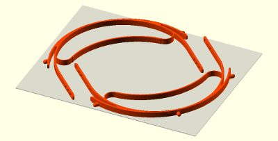

# Protective Face Shield for COVID-19

## Design for Reusable Headband with Low Cost Replacement Shields

> *New!*  Slim design released: features soft spring brow band, cord strap. Prints in half the time with half the material.  Add a brow shield for top protection.
>
> Supply and time shortages led to this modification.  Elastics are getting harder to find, but parachute cord exists in much larger volumes.  By designing the elasticity into the headband itself, a non-elastic cord can be used.  Reducing material for printing doubles production volume with no cost.

Fully assembled slim headband with face shield and brow shield

---

Slim headband with brow shield

---

Prior headband with cinch strap and face shield

---

The urgent need for personal protection equipment in this time of covid19 pandemic is the motivation for these documents.  This is an attempt to provide additional equipment by local community members to help with any shortages of approved equipment.  Please feel free to submit your own suggestions and feedback.

---
---

### For Users

Visors to shield the face are the first contact line of defense when confronted with infected persons.  It is the purpose of these designs to create a reusable headband that supports low cost, easily replacable shields.  Cheap plastic shields can consist of transparency sheets, lamination sheets, or other clear plastic sheets.

To make shields easy to obtain in the US market, a standard three-hole punch design is utilized.  Thus high volume production of shields requires only a ream of transparency sheets and a three-hole punch, both of which are widely available.  Alternate shield materials can also be used if dimensioned to the standard 11" width.

For other locations than US, the original designer, [Prusa](https://www.prusaprinters.org/prints/25857-prusa-protective-face-shield-rc1), has a four-hole punch design.

#### Instructions

- [Threading](LoopThread/ThreadInstructions.md) of band for cinch or slim cord designs.  Tip:  The band or cord should be approximately 18" (46cm).
- Making shields for [three-hole design](3HoleShieldInstructions.md)
- Making top [brow shields](BrowShieldInstructions.md) for three-hole design
- Making shields for four-hole design using [cut template](PrusaFaceShieldHolesRC2.pdf)

---
---

### For Makers

Help generate headbands for our urgent care providers. Choose a design that fits the band that you can obtain, or modify to your own design.  If you do create equipment, it is important to create a sterile environment and handling so that you don't accidentally transmit any virus.  Here you will find:

#### STL models
I've included a number of preconfigured STL models for different configurations (see **Design Tools** below for generating your own variations of STL).  Which model to choose will be determined by the elastic band materials you can obtain.  You can import any of these directly to your slicer (PETG is recommended material, 0.4mm nozzle, 0.2mm height, 20% infill):

##### STL design models for 3-hole shields using US standard hole punch
- Three-pin headband with **slim cord design** [(Qty 1)](stl/covid19_headband_3hole_cord_slim.stl) [(Qty 2)](stl/covid19_headband_3hole_cord_slim_qty2.stl) for parachute cord strap. Soft spring browband design provides elasticity.  *Slim design reduces print time and material by half!*

 

- Three-pin headband with **cinch design** [(Qty 1)](stl/covid19_headband_3hole_cinch.stl) [(Qty 2)](stl/covid19_headband_3hole_cinch_qty2.stl) for flat 3/4" (38mm) elastic bands (non-elastic bands can also marginally work)

- Three-pin headband with **button design** [(Qty 1)](stl/covid19_headband_3hole_button.stl) [(Qty 2)](stl/covid19_headband_3hole_button_qty2.stl) for button hole elastic band  (Update: Prusa has newly released their official version of this type of design.)

##### STL design models for 4-hole shields based on original Prusa RC2
- Four-pin headband with **slim cord design** [(Qty 1)](stl/covid19_headband_rc3_cord_slim.stl) [(Qty 2)](stl/covid19_headband_rc3_cord_slim_qty2.stl) for parachute cord strap. Soft spring browband design provides elasticity.  *Slim design reduces print time and material by half!*

- Four-pin headband with **cinch design** [(Qty 1)](stl/covid19_headband_rc2_cinch.stl) [(Qty 2)](stl/covid19_headband_rc2_cinch_qty2.stl)

- Four-pin unmodified **original Prusa design RC2** [(Qty 1)](stl/covid19_headband_rc2_button.stl) [(Qty 2)](stl/covid19_headband_rc2_button_qty2.stl) with button design 

#### CAD design tools used here so you can do your own modifications:

- OpenSCAD design [software](https://www.openscad.org/).  You'll need to read their documents if it's new to you.
- OpenSCAD design [code](covid19_headband_mods.scad) used to generate modified STL models (except slim cord design). You can easily choose your type and strap dimensions, self-expanatory parameters at beginning of the code.  Or use the code as a base for you own design code.

---

Thanks Josef Prusa and team for your open design upon which this visor is based.  Original model was obtained [here](https://www.prusaprinters.org/prints/25857-prusa-protective-face-shield-rc1).  Their [link](https://www.prusaprinters.org/prints/25857-prusa-protective-face-shield-rc1) provides good documentation of the design and use.  The modifications here were made to support rapid local use.
